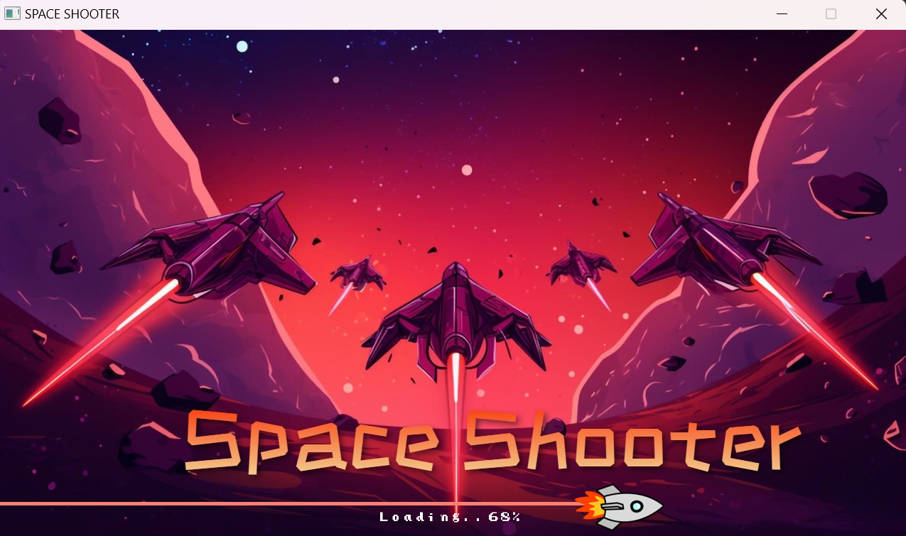
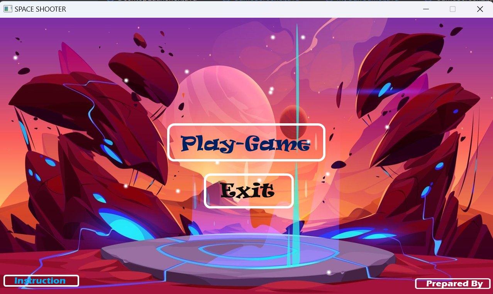
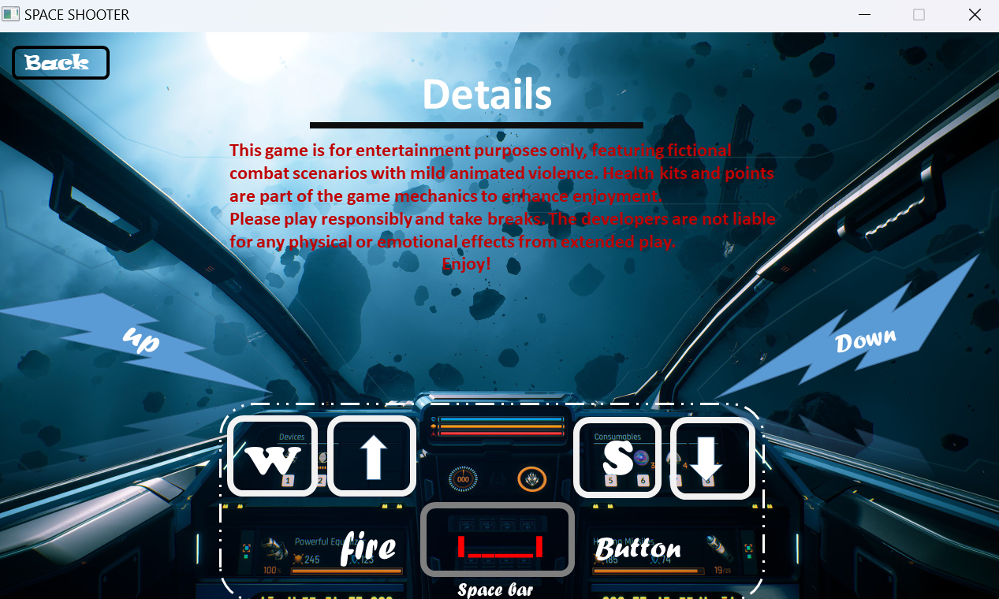
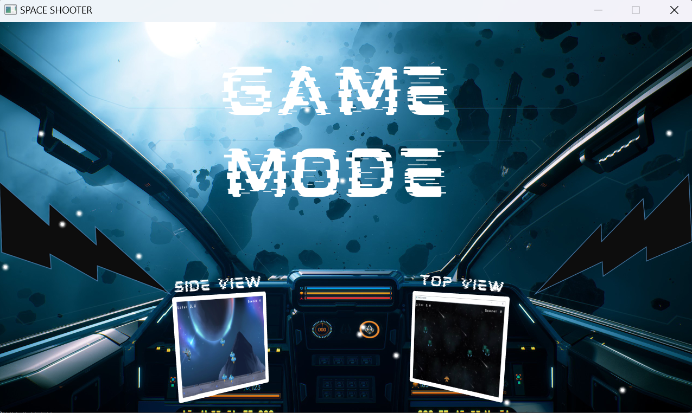
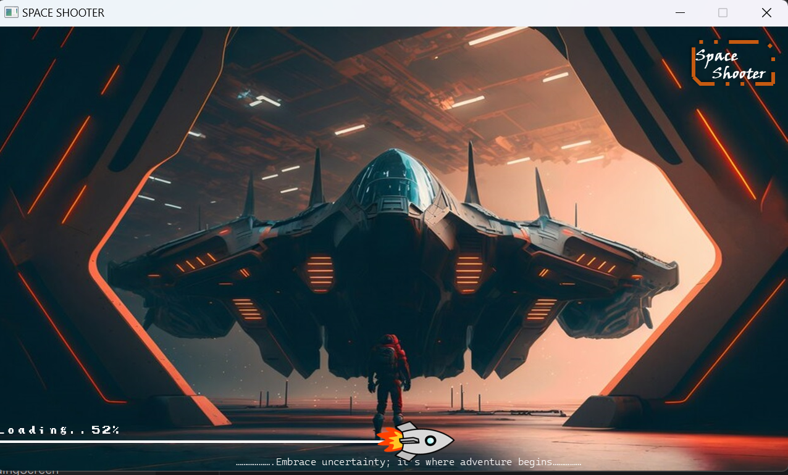
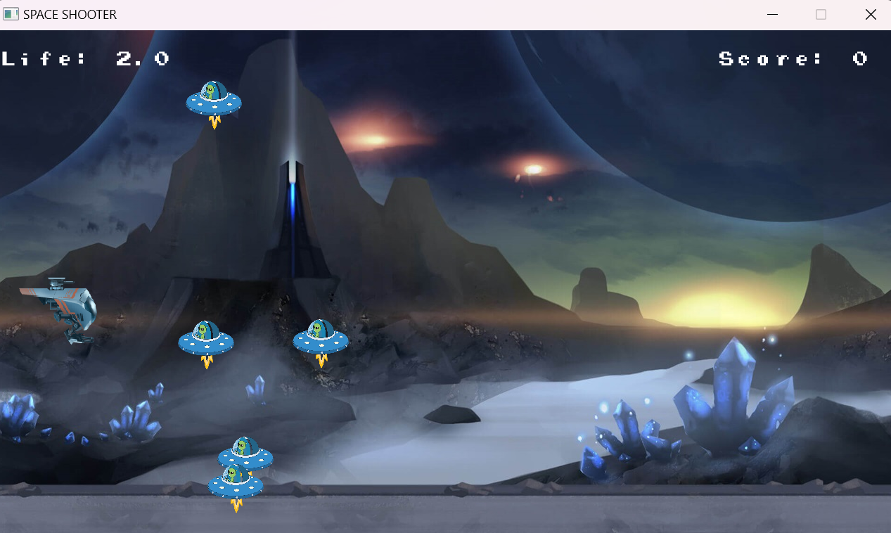
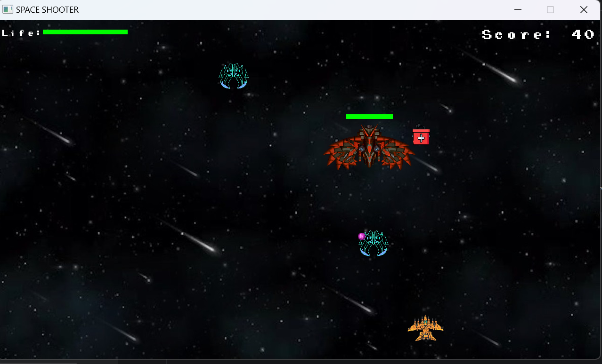
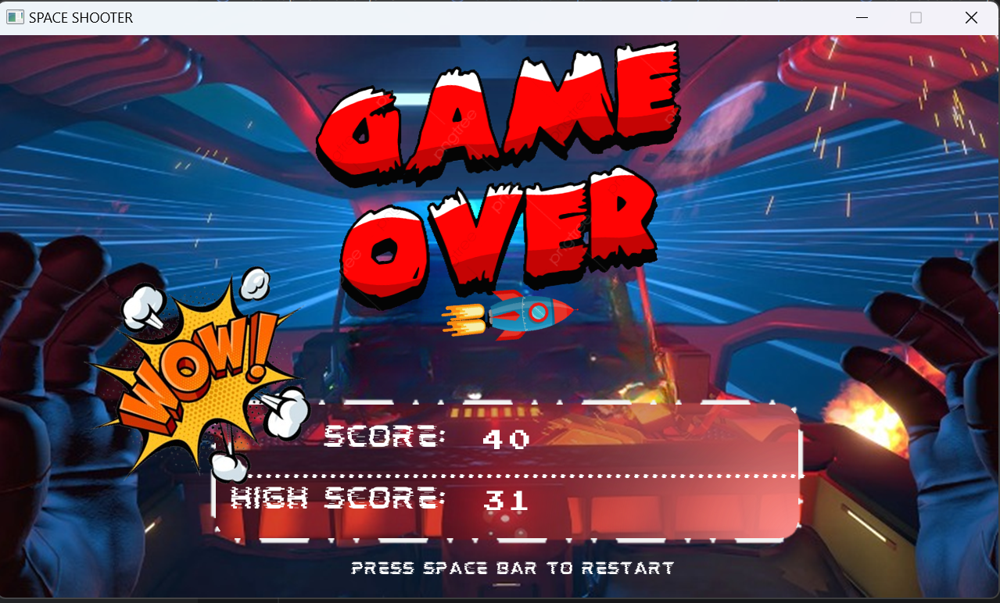

# 🎮Space_Shooter🚀

---

## Credits
This game was developed by:
- Name: **[Shawon Hossan]** (GitHub: [https://github.com/shawonkst21])
- Reg :2021831007
- Name: **[Snaha Das Bonosree]** (GitHub: [https://github.com/SnahaSree])
- Reg :2021831008
Special thanks to the LibGDX community for their excellent resources and support.

---

## Table of Contents
- [Introduction](#introduction)
- [Features](#features)
- [Technologies Used](#technologies-used)
- [Installation](#installation)
- [Gameplay](#gameplay)
- [Game Screens](#game-screens)
- [How to Play](#how-to-play)
- [License](#license)

---

## Introduction
**Space Shooter** is an action-packed 2D space shooting game built using Java and the LibGDX framework. Players take on the role of a space pilot, battling waves of enemies and bosses across multiple stages to score points and survive. This game was developed as part of a collaborative effort between [Shawon] and [Bonosree].

---
## preview
---
### GameEntryScreen:: The initial screen when the game starts.


---
### MainMenu: Navigate to start the game, view instructions, or exit.


---
### Instruction: Learn how to play the game and controls.


---
### GameMode:  Choose between different game modes and stages.


---
### loadingScreen: Appears when loading game assets before entering the game.


---
### Side_view GameScreen


---
### Top_view GameScreen


---
### GameOver: Displays win or lose based on the player’s performance after all stages are completed.


---


## Features
- **Multiple Game Screens**: Includes entry, main menu, instruction, game mode, and "prepared by" screens.
- **Two Game Modes**: Unique game modes with different challenges and progression.
- **Loading Screen**: Smooth transition into gameplay with a loading screen.
- **Multiple Stages**: Progress through various stages with increasing difficulty.
- **Health Kits**: Players can collect health kits to restore life during battles.
- **Boss Battles**: Face powerful bosses at the end of certain stages.
- **Scoring System**: Earn points by defeating enemies, advancing stages, and surviving longer.
-  **Win and Lose Conditions**: Players experience win and lose game over screens based on their performance.


---

## Technologies Used
- **Java**
- **LibGDX Framework**
- **IntelliJ IDEA/ Eclipse IDE** (or any IDE used)

---

## Installation

1. Clone the repository:
   ```bash
   git clone https://github.com/shawonkst21/swe-224-java-team-project
   ```

2. Open the project in your IDE of choice.

3. Make sure you have **LibGDX** set up in your environment.

4. Run the project:
   ```bash
   ./gradlew desktop:run
   ```

---

## Gameplay
Players control a spaceship in a galactic war against waves of enemies and bosses. Use agility and quick reflexes to destroy enemies, collect health kits, and survive as long as possible. Each boss defeated will grant extra points, but beware of their increased damage.

---

## How to Play
1. **Movement**: Use arrow keys (or WASD) to control your spaceship.
 ### *Control*

| Control | Player 1 | 
|---------|----------|
| UP      |     ↑    |     
| DOWN    |     ↓    | 
3. **Fire**: Press the spacebar to fire at enemies.
4. **Health Kits**: Pick up health kits that appear randomly to restore life.
5. **Power-ups**: Collect power-ups that increase firepower or provide shields.
6. **Survival**: Defeat enemies and bosses to earn points. If your life reaches zero, the game ends.
7. **Objective**: Survive as long as possible, defeat bosses, and complete all stages to achieve the highest score.

---

## License
This project is licensed under the MIT License - see the [LICENSE](LICENSE) file for details.

---

Feel free to modify the stage descriptions and placeholders as needed!
